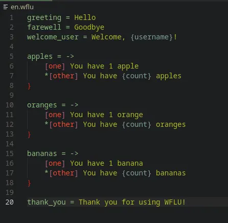

# WFLU Language Support for VS Code

Adds syntax highlighting and variable recognition for **WFLU (`.wflu`) files**, the lightweight localization format.  
[Learn more about WFLU](https://github.com/wyvern-social/WFLU)

## Features

- Syntax highlighting for:
  - **Keys**: e.g., `greeting`, `apples`
  - **Choice/Plural operators**: `->`, `[one]`, `*[other]`
  - **Block closing brace**: `}`
  - **Variables inside values**: `{username}`, `{count}`
- `.env`-style formatting: keys on the left, values on the right
- Works automatically for simple messages and choice/plural blocks

WFLU Syntax:

| Tool                  | Description                                                                                                     | Repository                                                                                                                                                           |
| --------------------- | --------------------------------------------------------------------------------------------------------------- | -------------------------------------------------------------------------------------------------------------------------------------------------------------------- |
| WFLU                  | Core WFLU library with parser for `.wflu` files, message retrieval, choice handling, and variable substitution. | [Repo](https://github.com/wyvern-social/WFLU) [NuGet](https://www.nuget.org/packages/WFLU)                                                                           |
| WFLU-Language-Support | VSCode extension for syntax highlighting on `.wflu` files.                                                      | [Repo](https://github.com/lunariixx/wflu-language-support) [VSCode Marketplace](https://marketplace.visualstudio.com/items?itemName=lunariixx.wflu-language-support) |
